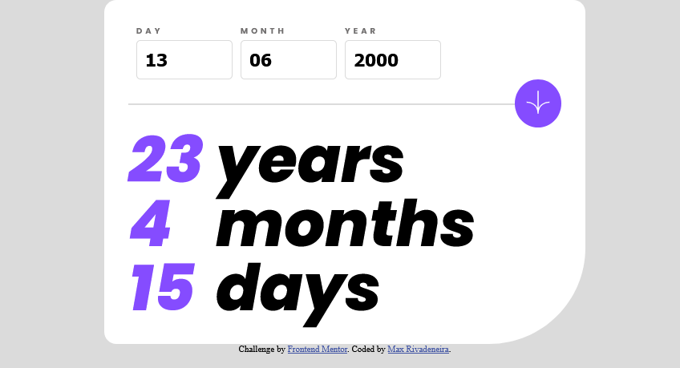

# Frontend Mentor - Age calculator app solution

This is a solution to the [Age calculator app challenge on Frontend Mentor](https://www.frontendmentor.io/challenges/age-calculator-app-dF9DFFpj-Q). Frontend Mentor challenges help you improve your coding skills by building realistic projects. 

## Table of contents

- [Overview](#overview)
  - [The challenge](#the-challenge)
  - [Screenshot](#screenshot)
  - [Links](#links)
- [My process](#my-process)
  - [Built with](#built-with)
  - [What I learned](#what-i-learned)
  - [Continued development](#continued-development)
- [Author](#author)
- [Acknowledgments](#acknowledgments)

## Overview

### The challenge

Users should be able to:

- View an age in years, months, and days after submitting a valid date through the form
- Receive validation errors if:
  - Any field is empty when the form is submitted
  - The day number is not between 1-31
  - The month number is not between 1-12
  - The year is in the future
  - The date is invalid e.g. 31/04/1991 (there are 30 days in April)
- View the optimal layout for the interface depending on their device's screen size
- See hover and focus states for all interactive elements on the page
- **Bonus**: See the age numbers animate to their final number when the form is submitted

### Screenshot



### Links

- Solution URL: [FrontEnd Mentor](https://www.frontendmentor.io/solutions/age-calculator-with-animation-and-flexbox-ME6mPuJb4H)
- Live Site URL: [Vercel](https://age-calculator-max.vercel.app/)

## My process

### Built with

- HTML
- CSS
- Flexbox 
- JavaScript

### What I learned

This proyect help me in learning how to display information clearly and making it appealing by using simple animations. When I put together the proyect layout I wanted a simple counting up animation when displaying the result of the calculated date. This was achieved by first storing the target value in a variable, setting a second variable vith value 0 and adding one to this variable until it reaches the same number as target value. 

I wanted to make a simple function that could animate any digit just by giving it a value and where it has to display the animation. The code is as follows: 

```js
  function animateDigit(value, position) {
    let timeAnimation = 60;
    let counter = 0; 
    if (value > 50) {
      timeAnimation = 30;
    }
    let i = setInterval(function() {
      if (counter == value) {
        clearInterval(i);
        document.getElementById("result-" + position).classList.add("ani-up");
        setTimeout(function(){
          document.getElementById("result-" + position).classList.remove("ani-up");
        },3000)
      }
      document.getElementById("result-" + position).innerHTML = counter;
      counter++;
    }, timeAnimation)
  }
```

The core of the function is inside setInterval. By using the same naming conventions on the id of the tags storing the resulting values, this function can find where the animation has to go with the input stored in "position". 

Inside the function there is an animation. It triggers when the target number has been reached and it is a simple bump to signal when that calculation is done. 

### Continued development

My main objective moving fowards is learning how to make better animations. I want to me able to create an odometer-like animation for the numbers.  

## Author

- Frontend Mentor - [@MRivadeneira92](https://www.frontendmentor.io/profile/MRivadeneira92)
- Twitter - [@Copland_max](https://twitter.com/Copland_max)
